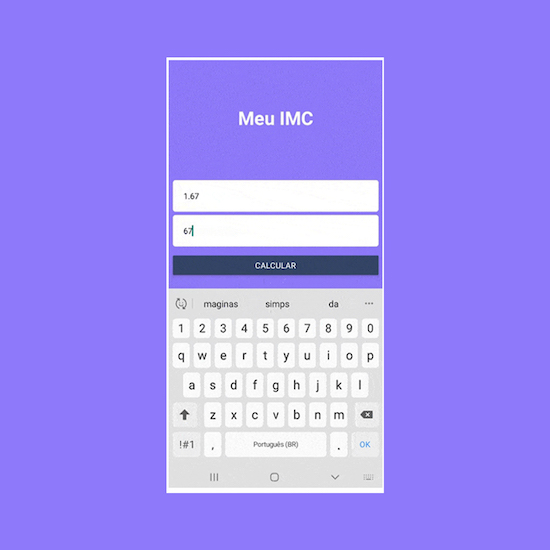
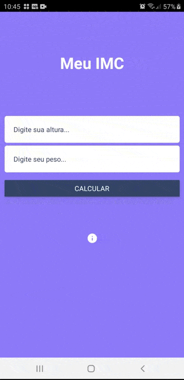

</img>

<h1 align="center">Meu IMC</h1>

Projeto <strong>Meu IMC </strong> desenvolvido com React Native

## Instalação

O App Mobile (React Native) desenvolvido:

</img>

Pode baixar o apk aqui: https://drive.google.com/file/d/1O3fjA9df-btGTzh3dWaCMoUHSFtIiiuM/view?usp=sharing

